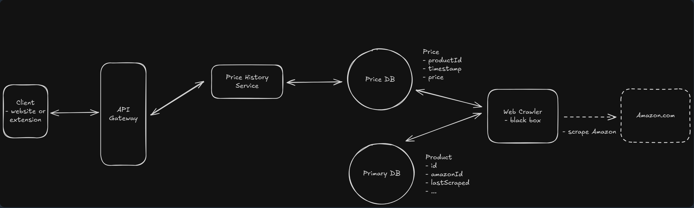
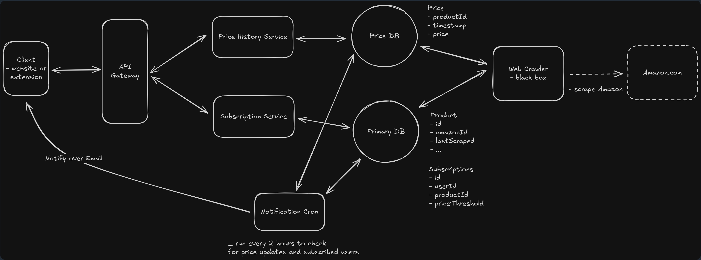
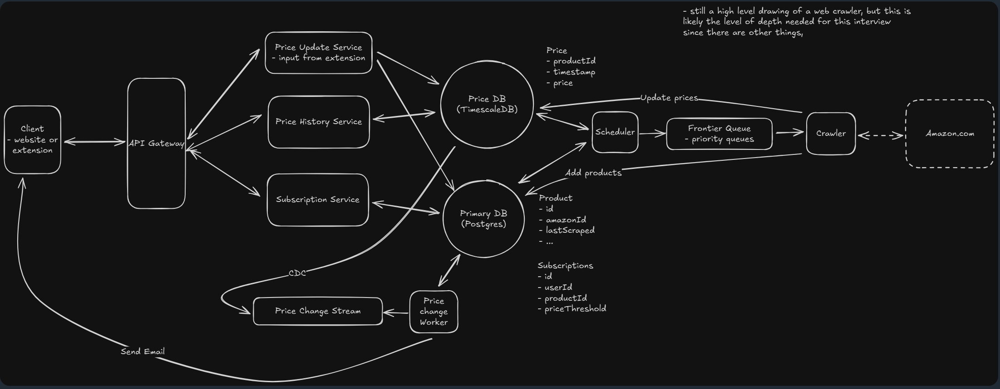
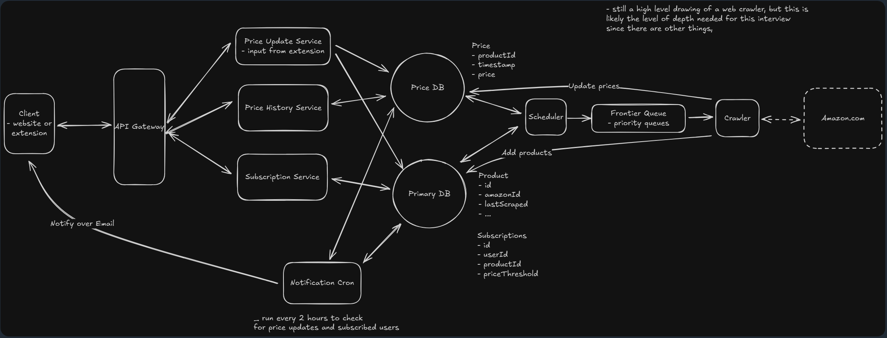
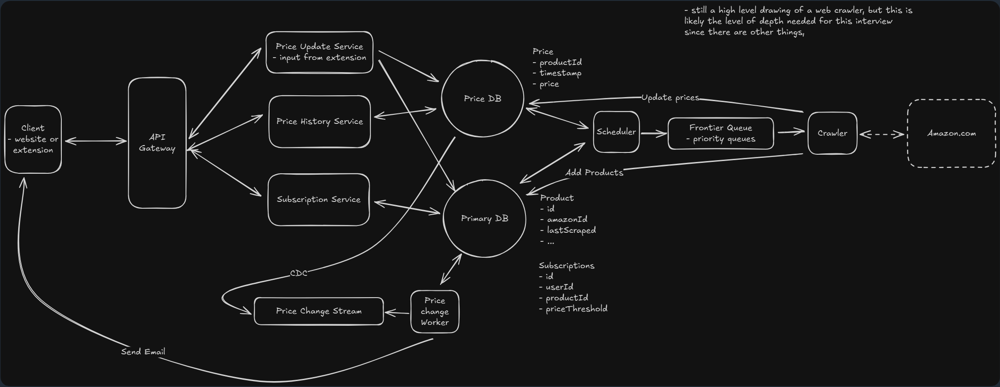

# Design a Price Tracking Service (CamelCamelCamel)

## Understanding the Problem

**📈 What is [CamelCamelCamel](https://camelcamelcamel.com/)?** 

CamelCamelCamel is a price tracking service that monitors Amazon product prices over time and alerts users when prices drop below their specified thresholds. It also has a popular Chrome extension with 1 million active users that displays price history directly on Amazon product pages, allowing for one-click subscription to price drop notifications without needing to leave the Amazon product page.

## Requirements Clarification

### Key Questions to Ask

- For this system, users should be able to: view price history for Amazon products (via website or Chrome extension) and subscribe to price drop notifications with thresholds (via website or Chrome extension)?
  - ✅ Yes, all of this
 
- How many products should the system manage?
  - 📊 500M Amazon products

- What is the latency requirement for users requesting for price drops or price history?
  - ⚡ The system should respond price drops or price history within 500 ms
 
- Within how long does the system need to deliver price drop notifications when prices change?
  - ⏱️ The system needs to deliver price drop notifications within 1 hr of price change
 
## Requirements

### Functional Requirements

**Core Requirements:**

1. Users should be able to view price history for Amazon products (via website or Chrome extension)
2. Users should be able to subscribe to price drop notifications with thresholds (via website or Chrome extension)

**Below the line (out of scope):**

- Search and discover products on the platform
- Price comparison across multiple retailers
- Product reviews and ratings integration

### Non-Functional Requirements

The scale and performance requirements for CamelCamelCamel are driven by Amazon's massive product catalog and the need for timely price notifications.

**Core Requirements:**

1. **Availability > Consistency:** The system can tolerate eventual consistency of price changes (it allows 1 hr of notification delivery), however it needs to manage 500M products, where availability and scalability are important
2. **Scale:** The system should handle 500 million Amazon products
3. **Low Latency:** Price drop or history requests should complete within 500 ms
4. **Timely Notifications:** Price drop notifications delivered within 1 hr from change

**Below the line (out of scope):**

- Strong consistency for price data
- Strong consistency for price data
- Real-time price updates (sub-minute)

> 💡 **Important Context:** We're building a system that must be "polite" to Amazon while providing valuable price tracking to millions of users. This creates interesting technical challenges around data collection, storage efficiency, and notification delivery that we'll address in our deep dives.

## The Setup

### Planning the Approach

We'll follow a systematic framework by building our design sequentially through each functional requirement, then use our non-functional requirements to guide our deep dive discussions on scaling challenges.

## Data Model / Core Entities

To satisfy our key functional requirements, we'll need the following entities:

- **Products:**
  - Represents an Amazon product we're tracking, including its current price and metadata needed for price history display and notifications
    - `productID`
    - `name`
    - `currentPrice`
    - `updatedTime`

- **Subscription:**
  - Links users to productIDs they want to monitor, specifying the price threshold that triggers notifications
    - `subID`
    - `userID`
    - `productID`
    - `threshold`

- **Price History:**
  - Time-series entity that captures price changes over time for a productID, enabling us to generate historical price charts
    - `productID`
    - `timestamp`
    - `price`

- **User:**
  - Represents a user of the service, containing their contact info and preferences for receiving price drop notifications
    - `userID`
    - `email`
    - `preferences`: { settings object containing notification delivery methods, formats, etc }

## API Design

The API is the main way users will interact with our price tracking service, both through our website and the Chrome extension. Let's design endpoints that directly support our two core functional requirements.

**Authentication & Caching Headers:**

- We'll use userID if the user is authenticated. The userID could be placed in a session token or JWT in the Authentication header:
  - `Authentication: Bearer <token>`

- Caching headers can be applied to fetch frequently accessed entries quicker:
  - `Cache-Control: no-cache max-age Private/Public`
  - "no-cache" means a browser may cache a response but must validate first
  - "Public" means the entry can be cached by any intermediary (proxy servers)
  - "Private" means an entry can only be cached by the browser

### Retrieve Price History for Charts

This endpoint retrieves the historical price data for a productID within a time range and using an interval (daily, weekly, monthly, etc). By using an interval/granularity, we can return averages over the interval for chart rendering.

**Request:**
```bash
GET /products/:productID/history?startTime&endTime&interval
# or with better naming:
GET /products/{product_id}/price?period=30d&granularity=daily
```

We include `product_id` in the URL path rather than the request body for better caching and REST compliance. The granularity parameter allows us to return daily averages for long periods or hourly data for recent timeframes.

**Response:**
```json
{
  "history": [
    { "timestamp": "2024-01-01", "price": 99.99 },
    { "timestamp": "2024-01-02", "price": 89.99 }
  ]
}
```

### Subscribe to Price Drop Notifications

Users can subscribe to price drop notifications for a specific threshold using this endpoint. An entry in the subscriptions entity will be created.

**Request:**
```bash
POST /subscriptions
{
  "productID": "ABC123",
  "threshold": 79.99,
  "notificationType": "EMAIL" // or "SMS"
}
```

**Response:**
```json
{
  "subscriptionID": "sub_456",
  "status": "active"
}
```

## Data Flow / Workflow

Before diving into the design, let's understand the high-level workflow. The workflow shows how information moves from initial collection to final user output.

Understanding this flow early in our design process serves multiple purposes:
1. It helps ensure we're aligned with our interviewer on the core functionality before getting into implementation details
2. It provides a clear roadmap that will guide our high-level design decisions
3. It allows us to identify potential bottlenecks or issues before we commit to specific architectural choices

> 🔍 **Key Insight:** In this case, the "hidden" requirement is that we need to be able to get the data in the first place!

**High-Level Data Flow:**

1. Web crawlers and Chrome extension collect current prices from Amazon product pages
2. Price data is validated and stored in our price history table
3. Price changes trigger events for notification processing
4. Backend servers determine price changes and send notifications to users if price drops below threshold

> 📝 **Note:** This is intentionally simple - we will improve upon this as we go, but it's important to start simple and build up from there.

## High-Level Design (HLD)

> ⚠️ **Important Constraint:** Amazon is not friendly to price tracking services. They don't provide an API, actively discourage scraping, and implement rate limiting (typically 1 request per second per IP address). We must design our system to work within these constraints while remaining respectful of Amazon's terms of service.

We'll build our design incrementally, starting with the most fundamental requirement and adding complexity as we address each successive need.

### 1. View price history (via website or Chrome extension)

Users want to see how prices have changed over time for specific Amazon products. This serves as the foundation of our entire system and breaks down into two distinct challenges: acquiring price data from Amazon and serving historical price queries efficiently. For the first iteration, we'll establish the basic data collection and storage infrastructure. Our architecture needs a web crawler to gather price data, a storage layer for historical prices, and an API service to serve price history to users.

We'll separate the Price History service from the crawler because they have different scaling characteristics. The history service needs to handle many concurrent read requests from users viewing charts, while the crawler operates on a scheduled basis with consistent write patterns. This separation also allows us to optimize each service independently.

Because the Price history service will also make frequent requests to the Price DB and compute the aggregated price history using the interval / granularity, we can utilize an ECS cluster / service running ECS tasks (containers to handle requests for price history) on compute or IO / memory optimized EC2 instances.

As for the databases, we'll make a strategic separation based on scale and access patterns. Our Primary DB will store products and subscriptions together since these have similar operational characteristics - they're relatively small and have traditional CRUD access patterns. However, we'll put our Price DB completely separate because price history data has fundamentally different requirements: it will grow to billions of rows, is append-only, requires time-series optimizations, and can tolerate eventual consistency. This separation allows us to optimize each database independently and scale them based on their specific needs.

Also, because the Price DB will need to be frequently updated, and is append only, we can likely use a high write intensive DB like Cassandra, which is perfect for this use case. The Cassandra schema could also look as follows, where the primary key will be the productID, while the clustering key will be the time, so that a partition is ordered by the time field:

```cql
create table priceHistory (
  productID UUID,
  time timestamp,
  primary key (productID)
) with clustering order by (time asc)
```

The Primary DB also will handle usual CRUD requests by the web crawler and other services like the Notification service, thus either Postgres or DynamoDB should work well here. If we use DynamoDB, we can likely use LSIs on the Products table, where the updatedTime could be the sort key, allowing the crawler to fetch productIDs which haven't been updated recently. Also, if using both Postgres or DynamoDB, we can create additional indexes (or GSIs) on frequently accessed fields which can further help to categorize the products into categories like tech, clothing, etc.

We'll choose to "black box" the web crawler service for now. We can assume it periodically scrapes Amazon product pages and updates the Price table. Of course, we'll go into more detail about just how this might be accomplished in our DD. For now, we can assume that the web crawler will also be run on multiple IO / memory optimized EC2 instances since it needs to make multiple network and DB requests.

The workflow for requesting the price history (via the website or Chrome extension) is as follows:
1. Client requests the endpoint 'GET /products/:productID/history'
2. The Price History service queries the Price DB using the productID and time range
3. The Price History service will then return the historical prices as JSON, ready to be rendered via the website or Chrome extension as a chart



### 2. Subscribing to price drop notifications with thresholds (via website or Chrome extension)

Building on our price history foundation, users now want to receive notifications when product prices drop below their specified thresholds. This introduces new requirements for user management, subscription storage, and notification delivery. We'll add new components while leveraging our existing infrastructure. For our initial implementation, we can start with a simple every 1-2 hr polling approach that gets the job done (likely via an Eventbridge schedule and lambda), knowing we can optimize this later in the DD.

This requirement should now use:
- Subscription service:
  - This service saves productID subscriptions and threshold settings in the subscriptions table
- Notification cron job:
  - Periodically checks for price changes using the Primary and Price DB, and sends email notifications (likely using a lambda that sends an SES email)

We'll separate the Subscription service from the Price History service because they serve different user actions and have different data access patterns. The Subscription service handles user account operations (create, update, delete subscriptions) which are not as frequent, while the Price History service focuses on read-heavy price queries.

For our initial Notification service, we have a straightforward batch processing approach:
1. Cron job runs every 1-2 hours to check for productID price changes within the past 1-2 hours
2. For each price change, the Notification service will query the subscriptions table from the Primary DB to find the subscriptionIDs and its notification preferences
3. The Notification service will send notifications for any triggered subscriptions. The Notification service could also mark the subscriptionID as being SENT with a updatedPrice field to avoid making duplicate notifications for the same updatedPrice

Note: This polling approach works but has obvious limitations. Users might wait up to 1-2 hours for price drop notifications, and we're doing expensive DB scans every few hours. We'll explore much better real-time approaches in the DD that provide notification delivery within minutes from price change.

The workflow will be as follows when a user subscribes to price alerts:
1. User requests the endpoint 'POST /subscriptions'
2. The Subscription service will create an entry in the subscriptions table using the userID, productID, threshold and notification preferences

This simple approach makes sure we have a working subscription system that satisfies our functional requirements. Users get price drop alerts (just not immediately), and our system remains easy to understand and debug. The periodic nature also prevents notification processing from interfering with our core price tracking functionality.



<br/>
<br/>

### Client

- The client is either the website or the Chrome extension. In either case, they're how the user views the price history charts

### API gateway

- The API gateway will handle authentication, rate limiting and route requests to appropriate services

### Price history service

- The Price history service will retrieve the price history from the Price DB, and return the data needed to create the charts

### Web crawler

- The Web crawler will crawl the Amazon product pages to collect current prices

### Price database

- The Price DB will store the price history table which contains the frequently updated historical price data

### Primary database

- The primary DB will store all other tables aside from the price history, such as the products and subscriptions tables

### Subscriptions service

- The Subscriptions service will allow users to create subscriptions for price alerts via the endpoint 'POST /subscriptions'

### Notification service

- The Notification service will request the Primary and Price DB via 1-2 hr polling in a cron job. It will find the price changes for productIDs, and send notifications for price changes if they have a subscriptionID. We'll discuss in the DD how we can deliver notifications within minutes from the productID's price change.

<br/>
<br/>



## Deep Dives

Time for the fun part! We'll take our existing, simple design and layer on complexity via our deep dives. When we're done, we'll have a system that satisfies all of our functional and non-functional requirements.

### 1) How do we efficiently discover and track 500 million Amazon products?

Up until now, we've been "black boxing" our web crawler, simply assuming it somehow gets price data from Amazon and updates our database. But when we confront the reality of discovering and tracking 500M products while respecting Amazon's rate limiting constraints, we realize this is actually one of our biggest technical challenges.

We're solving two distinct but related problems here:

**The Product Discovery Challenge:** We need to find all 500M existing products when we launch, plus discover the approximately 3,000 new products Amazon adds daily.

**The Price Monitoring Challenge:** We need to efficiently update prices for millions of known products while prioritizing which ones to check most frequently.

Both challenges face the same fundamental constraint of Amazon's rate limiting (1 request per second per IP), but understanding them separately helps us design more effective solutions.

#### ❌ Bad Solution: Naive Web Crawling Approach

**Approach:**

The most straightforward approach involves deploying traditional web crawlers that systematically browse Amazon's website. We start from seed URLs like Amazon's homepage and category pages, extract product links from each page, and recursively follow these links to discover the entire product catalog.

This treats Amazon like any other website to be indexed. We implement:
- A frontier queue containing URLs to visit
- A visited URL tracker to avoid cycles  
- Crawlers that process URLs sequentially
- Adding new URLs from product recommendations to the queue

**Challenges:**

The fundamental problem is scale arithmetic:
- **Time:** With 500M products and 1 request/sec/IP, a single crawler needs 15+ years just to visit each product once
- **Infrastructure Cost:** Even with 1,000 servers, we're looking at 5+ days for a complete refresh
- **Discovery Lag:** New products might not be found for weeks or months
- **Staleness:** Popular products that change prices multiple times per day will have stale data for extended periods

The massive infrastructure cost makes this economically unfeasible.

#### ✅ Good Solution: Prioritized Crawling Based on User Interest

**Approach:**

Product popularity follows a Pareto distribution - a small percentage of Amazon's products get the vast majority of user attention, while there's a long tail of rarely-viewed products. Instead of treating all 500M products equally, we tier our crawling based on actual user interest.

We implement a priority scoring system:
- Products with many price drop subscriptions → **highest priority** (check every few hours)
- Frequently searched products → **elevated priority** (check daily)
- Low-interest products → **low priority** (check weekly or less)

Features:
- Feedback loops where successful notifications boost product priority
- Self-reinforcing system focusing on the most valuable updates
- Excellent coverage for products that matter most using a fraction of the infrastructure

**Challenges:**

- **Coverage gaps** for new or trending products that haven't built up interest signals yet
- A hot new product release might not get discovered quickly
- Missing early adoption opportunities when prices are most volatile

#### ⭐ Great Solution: Chrome Extension + Selective Crawling

**Approach:**

> 💡 **Key Insight:** Remember that Chrome extension with 1 million users? It's more than just a convenience feature - it's actually our secret weapon for data collection!

The most elegant solution leverages our Chrome extension's 1M users as a distributed data collection network. When users browse Amazon with our extension installed, it:
1. Automatically captures product IDs, current prices, and page metadata
2. Reports this information to our backend services
3. Provides real-time price data for products users are actively viewing
4. Naturally prioritizes popular and trending items

**How it works:**
- Extension operates transparently using DOM parsing
- Sends updates to our price reporting API
- Crowdsources data for products people actually care about
- No extensive crawler infrastructure needed

Our traditional crawlers now only handle:
- Products that haven't been viewed by extension users recently
- Using a priority queue (SQS delayed message FIFO queue) to prioritize popular and recently "not-crawled" products
- Verification of suspicious price reports

**Benefits:**
- Turns our biggest constraint (needing to monitor millions of products) into a competitive advantage
- Natural prioritization through user behavior
- Significantly reduced infrastructure needs
- Real-time data for popular products

**Challenges:**

- Dependency on user adoption and browsing patterns
- Products in niche categories might receive infrequent updates
- **Data validation challenge:** User-generated price reports could be manipulated or incorrect (we'll address this next!)

> 💬 **Interview Tip:** If you're thinking, "How would I know about Chrome extensions?" - don't worry! In interviews, the interviewer usually hints: "Your extension is installed on millions of browsers actively viewing product pages. Can you make use of that somehow?"

**Implementation Details:**

Instead of having a scheduler within the crawler, the Price Update service could directly queue the crawl request into the frontier queue using SQS's delayed message feature (for assigning crawl request priority) to validate the price change. Additionally, to further ensure ordering of price changes for similar productIDs, we can add a `messageGroupID` where messages in the messageGroupID will be ordered.



### 2) How do we handle potentially malicious price updates from Chrome extension users?

The Chrome extension approach from our previous deep dive creates a powerful data collection advantage, but it introduces a critical reliability challenge. With 1M users potentially submitting price data, we must assume that some percentage will be malicious actors, mistaken users, or systems experiencing technical issues.

**Scenario to Consider:** A malicious user reports that the latest iPhone costs $0.01, triggering price drop notifications to thousands of subscribers. Users rush to Amazon only to find the normal price, damaging our credibility and user trust. Our notification system's effectiveness depends entirely on data accuracy.

#### ✅ Good Solution: Consensus-Based Validation

**Approach:**

While we may have a few bad actors, they're unlikely to be pervasive. Instead of immediately accepting any price report, we wait until we have N independent users report the same price change before marking it as validated and triggering notifications.

**How it works:**
- Hold price updates in a "pending validation" state
- Maintain a consensus table tracking reports per product within a time window (e.g., 1 hour)
- Require threshold before accepting: 3 users for popular products, 2 for less popular ones
- Higher thresholds for significant drops (e.g., $500 drop on iPhone needs 5 confirmations)
- Track user reputation over time; accurate users count more heavily

**Benefits:**
- Natural defense against both malicious actors and technical errors
- Single bad actor can't trigger false notifications
- Technical issues unlikely to affect multiple users identically

**Challenges:**
- **Delay for legitimate changes:** Especially for niche products with few viewers
- **Flash sales:** Limited-time offers could expire before reaching consensus
- **Popular product backlogs:** Major sales events create validation backlogs
- **Coordinated attacks:** Bad actors could still coordinate to beat the system

#### ⭐ Great Solution: Trust-But-Verify with Priority Verification

**Approach:**

The best approach is simple: **trust the extension data immediately, but verify it quickly when something looks suspicious.**

**How it works:**

1. **Accept immediately:** When extension reports a price change, accept it and can send notifications right away
2. **Assign trust scores:** Based on userID, email, or IP from subscription/search history
3. **Queue verification for suspicious changes:**
   - Huge price drops
   - Reports from users with poor history
   - Popular products with many subscribers
4. **Priority crawler verification:** Suspicious updates get checked within 1-5 minutes (not hours/days)
5. **Correction handling:** If crawler finds extension data was wrong:
   - Send correction notifications
   - Mark user as less trustworthy
6. **Consensus for conflicts:** When multiple users report different prices, immediately verify

**Benefits:**
- Most extension data processed immediately → **fast notifications**
- Bad data caught quickly enough to prevent real damage
- Users get fast alerts for legitimate deals
- Maintains trust through corrections
- Natural trust scoring system evolves over time

**Challenges:**
- Adds complexity to crawling infrastructure
- Requires priority queue management
- Additional verification load on Amazon's servers
- Potential for rate limiting or IP blocking

> 💡 **Key Tradeoff:** This trust-but-verify approach strikes an excellent balance, providing immediate user value while maintaining the data integrity essential for long-term trust.

### 3) How do we efficiently process price changes and notify subscribed users? 

Right now, we're using a straightforward cron job that runs every 1-2 hours to scan for price changes and send notifications. While this might work for basic functionality, it fails to meet our non-functional requirement of delivering notifications within 1 hour of price changes. More critically, the polling approach creates massive database load as we scale to millions of price updates and subscriptions.

**Why this matters:**

The Notification service's effectiveness directly impacts user experience. Users expect timely notifications for price drops, especially for competitive deals that might sell out quickly. A 1-2 hour delay often means missing time-sensitive opportunities, making our service less valuable than competitors with faster notification systems.

**The Core Problem:**

The fundamental problem with our current polling approach is that we're asking the wrong question at the wrong time. Instead of asking "what changed in the last 1-2 hrs?" every 1-2 hrs, we should be asking "who cares about this change?" immediately when a change happens.

Moving to event-driven notifications is straightforward. When a price changes, we immediately know which users need alerts without expensive DB scans. We have two solid ways to implement this, each with different trade-offs.

#### Option 1: CDC to Kafka's Price Change Stream → Price Change Workers Send Notifications

**Approach:**

Database Change Data Capture (CDC) automatically publishes events whenever price data changes. We configure our Price DB to publish to Kafka when prices change.

**How it works:**

1. Price Update service or crawler workers insert new price records into Price DB
2. Price DB (via CDC like DataStax for Cassandra) sends messages to Kafka containing:
   - productID
   - old price  
   - new price
3. Notification service's Price Change workers subscribe to Kafka topics (organized by category like "laptops")
4. Upon consuming messages, workers:
   - Query Subscriptions table to find affected users
   - Send notifications to users whose thresholds are triggered

**Benefits:**
- Clean separation: price changes automatically trigger notifications
- No application-level coordination needed
- Database handles event publishing
- Completely automatic workflow

**Challenges:**
- Overhead of database triggers on every price update
- Less control over which changes trigger events
- Dependency on database CDC capabilities



#### Option 2: Dual Writes (Price Update Service/Crawler Writes to Both Price DB and Kafka)

**Approach:**

The Price Update service and crawler write to both the Price DB and publish messages to Kafka simultaneously.

**How it works:**

1. When crawler data or extension updates come in:
   - Services write to Price DB
   - Services also publish messages to Kafka
2. Notification service's Price Change workers consume from Kafka
3. Workers query Subscriptions table and send notifications

**Benefits:**
- **Smarter filtering:** Can filter out tiny price fluctuations before publishing
- **Batching:** Can batch multiple rapid changes using Kafka's batch size/interval properties
- **No database overhead:** Avoids triggers on every single update
- **More control:** Application decides which changes warrant notifications

**Challenges:**
- Requires application-level coordination
- Risk of data inconsistency if one write fails
- More complex application logic

**Implementation Details:**

Regardless of which option we choose, the Notification service's Price Change workers (Kafka consumers) work the same way:

1. Read price change messages from Kafka
2. Immediately query Subscriptions table to find users whose thresholds have been triggered
3. For each matching subscription, send email notification
4. Track last notification sent to avoid duplicates

**Scaling Considerations:**

- Most products don't change price very frequently → manageable event volume
- When popular product drops: one query finds all subscribers, send notifications immediately
- Can partition Kafka topics by category for better distribution
- Multiple consumer groups for parallel processing

> 💡 **Key Insight:** The beauty is that we only process actual price changes rather than expensive table scans of millions of records. This dramatically reduces database load while providing near-instant notifications.

### 4) How do we serve fast price history queries for chart generation?

Consider the scale challenge that comes from aggregating price data for popular productIDs. Popular productIDs might have price data points every few hours for several years, resulting in many thousands of records per product. When users request a 2 year price chart, we must aggregate this data into appropriate time buckets (daily or weekly averages) and return it quickly enough for smooth user experience. Raw database queries struggle with this aggregation workload.

To optimally select the Price DB, we could use the following:
- Scheduled pre-aggregation with cron jobs
  - By using this approach, when new price updates come into the Price DB, the pre-aggregated data may become stale and thus require the cron job to be re-run to update the pre-aggregated data. However, because this is still an aggregation, this staleness may be acceptable since users are looking at historical trends using this feature rather than real-time price changes.
- TimescaleDB for real-time price analytics
  - The TimescaleDB approach provides the performance and flexibility needed for production-scale price chart serving while maintaining the real-time responsiveness users expect. By choosing the right tool for analytical workloads, we achieve both simplicity and performance without complex caching or pre-aggregation strategies.
  - However, one down-side of using this approach is that TimescaleDB is still an extension of Postgres, and thus the underlying Postgres Price DB may not be able to handle a very large write load for 500M productIDs, like with Cassandra.
- Cassandra (our selected Price DB)
  - Overall, we could use either TimescaleDB or Cassandra for the Price DB. While Cassandra does have a better write load, TimescaleDB will be better in returning price history over different intervals / granularities because it provides built-in features to query aggregations quickly, whereas Cassandra will use the clustering keys to return ordered aggregated data.
  - However, if using Cassandra, instead of aggregating the data ourselves, we could create multiple tables containing different aggregation granularities (daily, weekly, monthly) such that when price changes come in, the updates will be made to all of the Cassandra tables accordingly. This is actually how Cassandra is meant to be used, where we create tables for the specific aggregation queries themselves (daily, weekly, monthly), instead of aggregating the data in our own CQL query.

A CQL query on the Price DB's daily table might look as follows:

```cql
select time, price from priceHistoryDaily
where productID = :productID and time between :startTime and :endTime
```

### Scaling the components

#### Stateless services (Price Update / Price History / Subscriptions / Notification service's Price Change workers / Crawler workers)

All of the stateless services, such as the Price Update, Price History and Subscriptions services will likely run multiple EC2 instances within an ASG behind an ALB. Because price updates and price history requests may be more frequent, we can easily horizontally scale the Price Update and Price History services.

Both the Price Change workers and Crawler workers will have the similar responsibility of polling a queue (Kafka and SQS respectively) to process the price changes and crawling requests respectively. 

Because of this, the Price Change workers will likely be consumer workers (running within ECS tasks) in multiple consumer groups, where we can scale additional consumer workers when price changes occur more frequently. Also, to handle spikes in Kafka, we can configure a batch size / interval and buffer size / interval in which we can temporarily buffer messages to give more time for consumer workers to process them. We can also increase the polling wait time within the consumer workers to ensure spikes don't cause a SPOF.

The Crawler workers will also likely be ECS tasks which will poll the SQS queue (frontier queue) for crawler requests. If using ECS, we can also scale both the number of ECS tasks and EC2 instances using ECS service's auto-scaling and an ASG respectively. By using an ECS service's auto-scaling feature, we can scale the number of ECS tasks using Cloudwatch metrics like SQS queue size, CPU usage, etc.

#### Price DB

As mentioned before, we can scale the Cassandra Price DB by partitioning the table's rows using time as the clustering key. We can also create multiple tables for different aggregation granularities to improve the read load on the price history chart generation.

#### Primary DB

Because the Primary DB is storing the products and subscriptions tables, we can likely shard the products by their category. This way, because it's likely for similar products belonging to the same category to drop in price (during sales), queries on the products table for multiple productIDs for the same category could go to the same shard.

We could also likely shard the subscriptions table by the userID, such that subIDs for the same userID are all in the same shard. However, some users might have multiple subIDs, which might cause an uneven distribution across the shards. To handle this, our service could limit the number of subscriptions according to different user premium membership subscriptions.

#### Price Change stream (Kafka)

We mentioned that we're using Kafka as the Price Change stream, where the Price Update service and Crawler's workers will publish price changes into the Kafka topics. It's important to note that we can't have a single topic per productID. While a Kafka cluster can have an unlimited number of topics, it's still limited by the broker hardware's storage. We can likely maintain 500k - 1M topics in a largescale Kafka cluster that's running across multiple storage optimized EC2 instances. Therefore, a topicID would instead need to reference multiple productIDs using some categoryID, like "laptops" or something more specific like "mac-laptops".

By having a topic reference a categoryID, there will be less infrequently accessed topics because a topic != productID. The productID to topic distribution also won't be as sparse. Lastly, to ensure price updates for the same productID come in order, we can partition a topic using a more granular category such as "mac-laptops-14-inch". This way, a topic's partition will have ordered price change messages which the Price Change workers can safely consume from.

## Final Design Summary

Taking a step back, we've designed and scaled a system that can intelligently collect price data from Amazon, validate it, and notify users when prices drop - all while serving price history charts to users in real-time.

**Key Architectural Decisions:**

1. **Data Collection:** Hybrid approach using Chrome extension crowdsourcing + selective web crawling
2. **Data Validation:** Trust-but-verify system with priority verification for suspicious updates
3. **Notifications:** Event-driven architecture using CDC/Kafka for real-time alerts
4. **Price History:** Time-series database (TimescaleDB) or Cassandra with pre-aggregated tables
5. **Scaling:** Horizontal scaling of stateless services, strategic database sharding, and Kafka topic partitioning

## What is Expected at Each Level?

### Mid-Level Expectations

At mid-level, I'm looking for candidates who can create a working high-level design that addresses the core functional requirements - price history display and notification subscriptions. You should:

- ✅ Understand the basic challenge of collecting price data from Amazon
- ✅ Propose a simple web scraping approach (even if not perfectly scalable)
- ✅ Design a straightforward database schema with products, users, subscriptions, and price history
- ✅ Recognize scale limitations when guided and understand why prioritization might be necessary
- ✅ Move from polling to event-driven approaches with some guidance

### Senior Expectations

For senior candidates, I expect you to quickly identify that data collection is the core technical challenge and drive the conversation toward solutions. You should:

- ✅ Proactively recognize the Chrome extension as a data collection opportunity
- ✅ Understand trade-offs between different crawling strategies
- ✅ Realize that crawling 500M products requires either immense resources or endless time
- ✅ Explain why polling doesn't scale and propose event-driven alternatives using message queues
- ✅ Go deep on at least a couple of deep dives (even if different from the ones presented)
- ✅ Consider operational complexity and maintainability

### Staff+ Expectations

For staff candidates, I'm evaluating your ability to see the bigger picture and balance technical elegance with operational reality. You should:

- ✅ **Systems Thinking:** Proactively recognize that the Chrome extension isn't just a user feature, but solves the fundamental data collection scaling problem
- ✅ **Evolution Planning:** Discuss system evolution thoughtfully - how do we start simple but design for the scale we'll eventually need?
- ✅ **Business Impact:** Understand business implications of technical choices (e.g., why data validation affects user trust and retention, not just technical correctness)
- ✅ **Proactive Problem-Solving:** Surface concerns not explicitly asked about:
  - Handling Amazon's anti-scraping measures
  - Managing extension user privacy
  - Planning for Amazon page structure changes
  - Cost optimization strategies
- ✅ **Cross-Component Thinking:** Demonstrate how different components affect each other
- ✅ **Long-term Architecture:** Propose solutions that prioritize long-term maintainability alongside immediate functionality

## Key Takeaways

1. **Leverage Existing Assets:** The Chrome extension isn't just a feature - it's a scalable data collection mechanism that turns users into distributed sensors
2. **Trust But Verify:** Balance speed with accuracy by accepting data immediately but validating suspicious changes quickly
3. **Event-Driven > Polling:** For real-time systems, asking "what changed?" after the fact is less efficient than being notified when changes happen
4. **Choose the Right Tool:** Time-series databases (TimescaleDB) excel at analytical queries, while Cassandra excels at write-heavy workloads
5. **Design for Scale:** Consider not just if your system works, but if it works at 500M products with 1M users

---

*This design demonstrates how to build a production-grade price tracking system that respects external API constraints while delivering excellent user experience through clever architectural choices and appropriate technology selection.*


